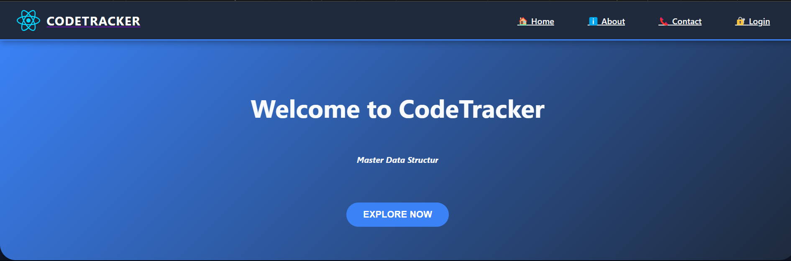

# 🧠 **c-o-d-e-t-r-a-c-k-e-r**

<p align="center">
  Track your coding journey — from practice problems to daily progress logs — all in one sleek, minimalist web app.
</p>

<p align="center">
  
  
  
</p>

---

## 📸 **Preview**



---

## ✨ **Overview**

**c-o-d-e-t-r-a-c-k-e-r** is a lightweight and efficient web application designed to help developers stay consistent with their coding practice. Whether you're solving DSA problems, building side projects, or learning something new, this app helps you log, track, and stay accountable in your coding journey.

---

## 🚀 **Features**

- 📋 **Organize your progress**: Track coding problems, goals, and tasks with ease.
- 🌓 **Light/Dark theme**: Toggle between light and dark themes, with persistent settings.
- 📆 **Timeline logging** *(coming soon!)*: Log and visualize your daily coding activity.
- ⚡ **Fast and efficient**: Built for performance and minimalism.
- 🎨 **Sleek design**: Minimalistic UI for a focused and smooth experience.

---

## 🛠️ **Getting Started**

Follow these steps to get the app up and running on your local machine:

1. Clone the repository:
    ```bash
    git clone https://github.com/yourusername/c-o-d-e-t-r-a-c-k-e-r.git
    ```

2. Install dependencies:
    ```bash
    pnpm install
    ```

3. Run the app in development mode:
    ```bash
    pnpm run dev
    ```

Now visit `http://localhost:3000` to view the app!

---

## 💡 **Technologies Used**

This app is built using the following technologies:

- **React**: A JavaScript library for building user interfaces.
- **Vite**: A fast build tool for modern web projects with instant hot module replacement.
- **PNPM**: A fast, disk space-efficient package manager.
- **CSS**: For responsive design and smooth transitions.
- **React Router**: For client-side routing between pages.

---

## 🌈 **Themes**

- **Light/Dark Theme**: Toggle between a light or dark mode to match your preference.
- **Persistent Theme**: Your theme preference is saved and remains consistent even after refreshing the page.

---

---

## 👥 **Contributing**

We welcome contributions to enhance **c-o-d-e-t-r-a-c-k-e-r**! Here's how you can contribute:

1. **Fork** the repository to your GitHub account.
2. Create a **new branch** from `main`.
3. **Make your changes** and ensure everything works as expected.
4. **Open a pull request** with a clear description of your changes.

For larger features or changes, please open an issue first to discuss the approach.

---

## 📬 **Contact**

Feel free to reach out with any questions, suggestions, or issues:

- **Email**: [contact@codetracker.com](mailto:contact@codetracker.com)
- **GitHub**: [@PREM015](https://github.com/PREM015)

---

## 💬 **License**

This project is licensed under the **MIT License**. See [LICENSE](LICENSE) for more details.

---

> **Start tracking your coding journey today with c-o-d-e-t-r-a-c-k-e-r! 🚀**
